sumerian steps
## suemrian basic config
1. create new scene
    1. under "Create scene from template" choose "Augmented Reality" 
    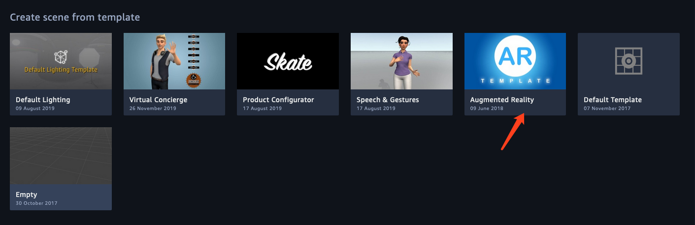
    
    2. enter new scene name "red pack" and click "create" button
    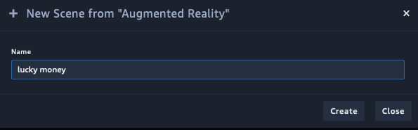
3. after loading for a few seconds, we came into suemrian console panel.
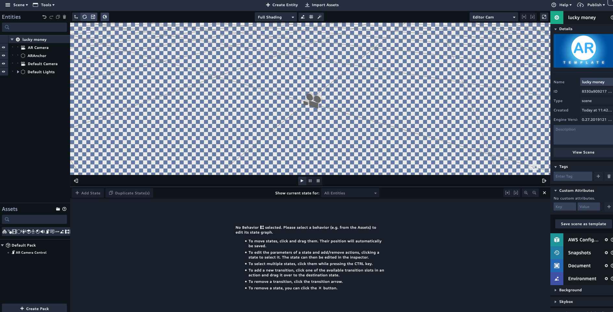
## sumerian entity create
1. in the assets panel, click file button and choose the template file we offered.
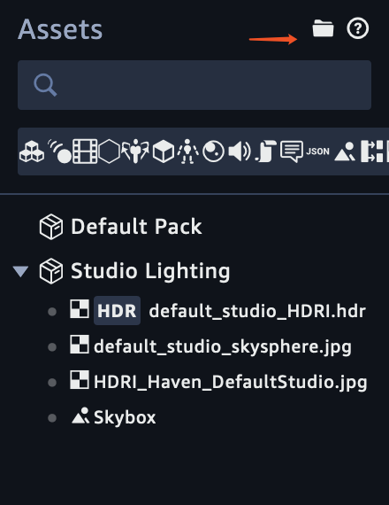
2. after loading you can see the entities in template we offered.
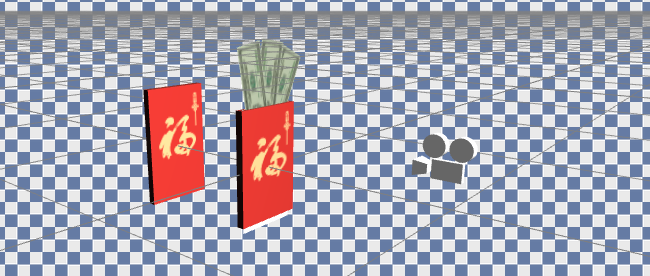
3. click the arrow button and drag to move the entities.
## action config asset
### default red pack action setting
1. click the "box" entity and click "add component" button, choose "state machine"

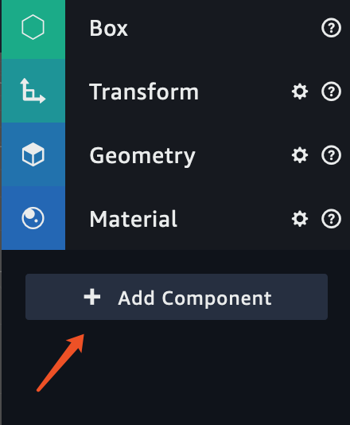

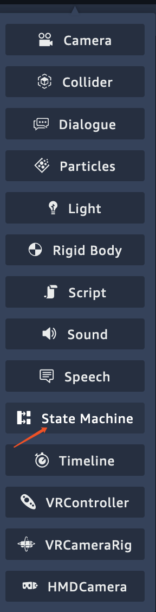

2. click the "+"(plus) button 

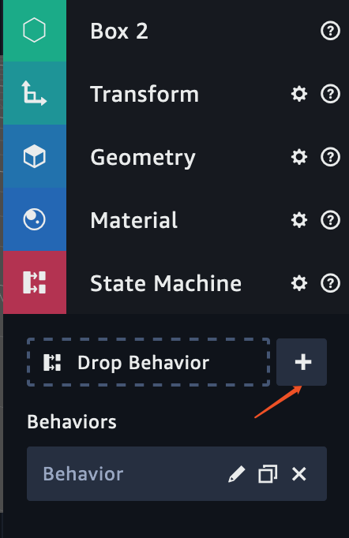
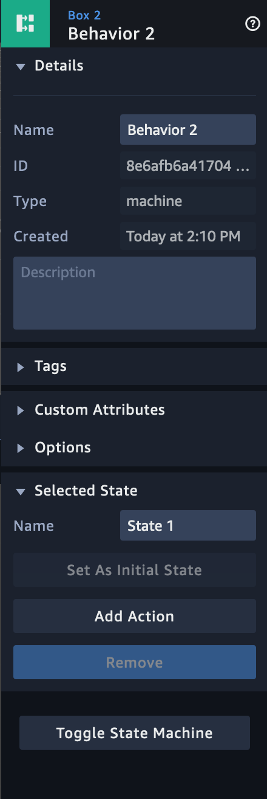

3. input the behavior name and input the state name"wait to be clicked"
4. click add action

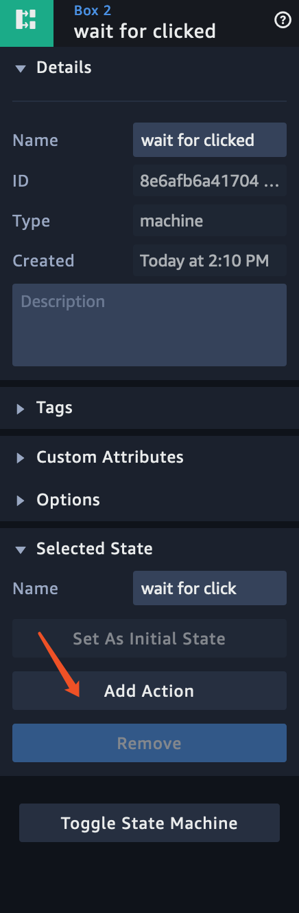

5. input "click" in the search area and choose the "click/tap on entity"

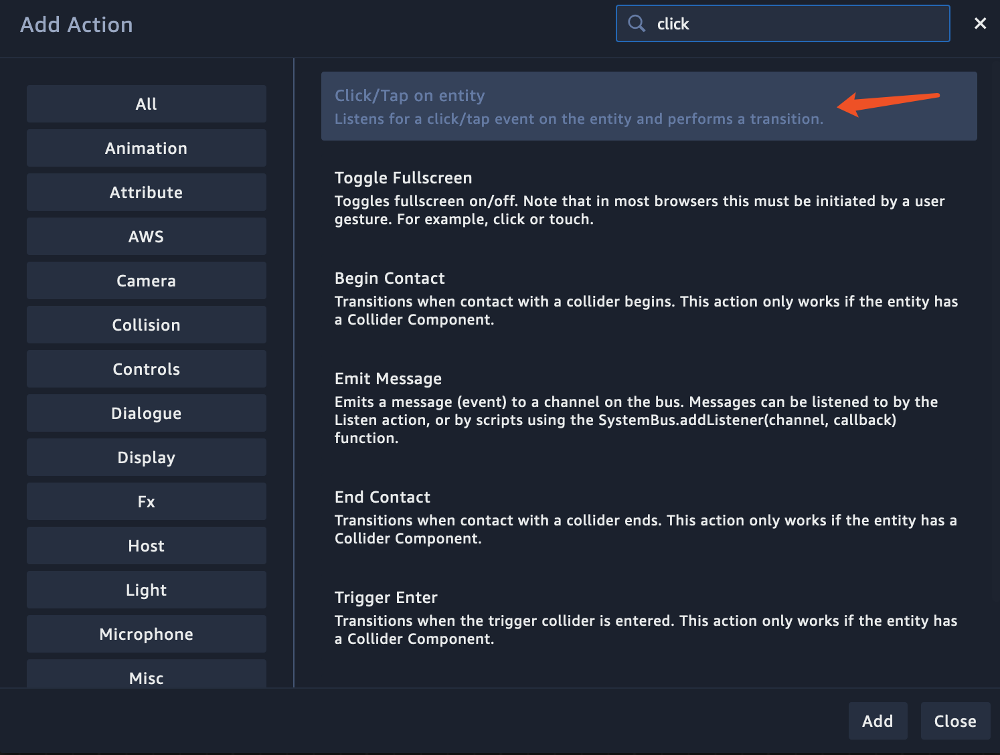

6. click "add state"  

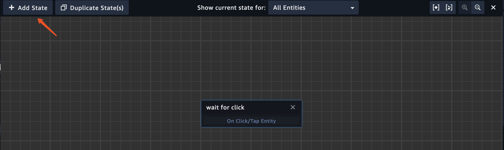
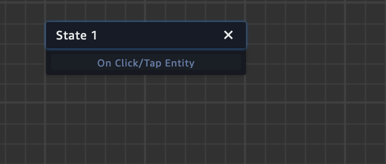

7. drag the "state 1" rectangle to the right side

8. name the state "hide"

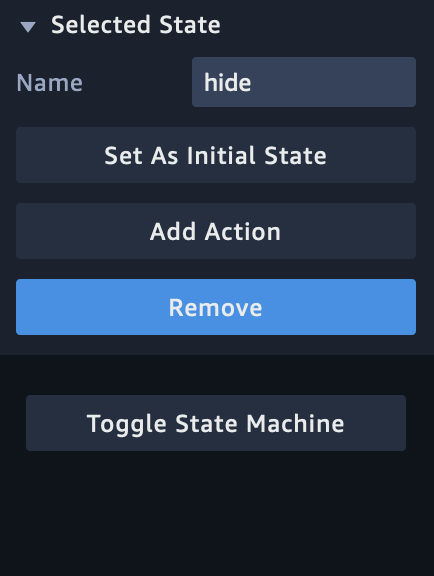
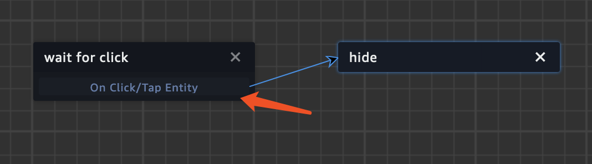

9. click "Add action" and search hide, click add

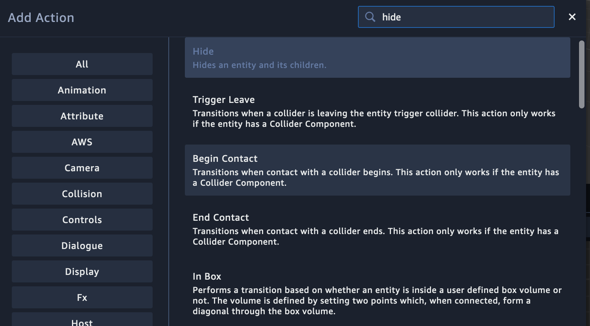

10. click "add action" and search emit, click add

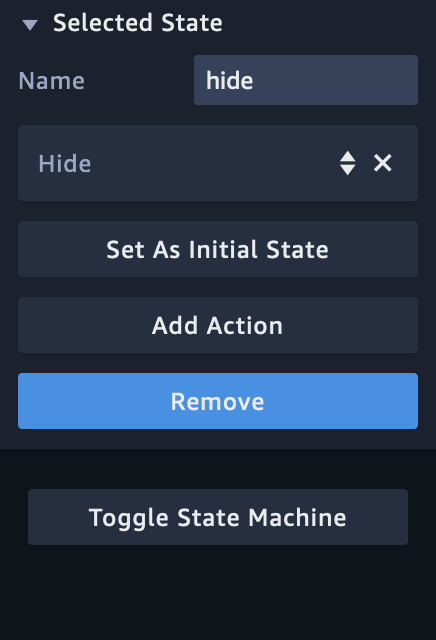
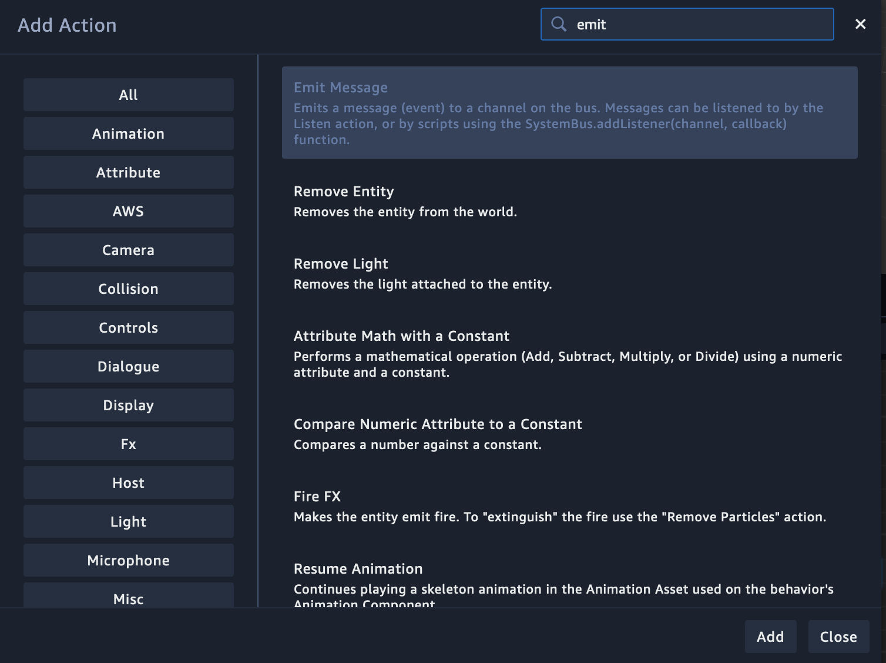

11. inside the channel, input "showMoney"

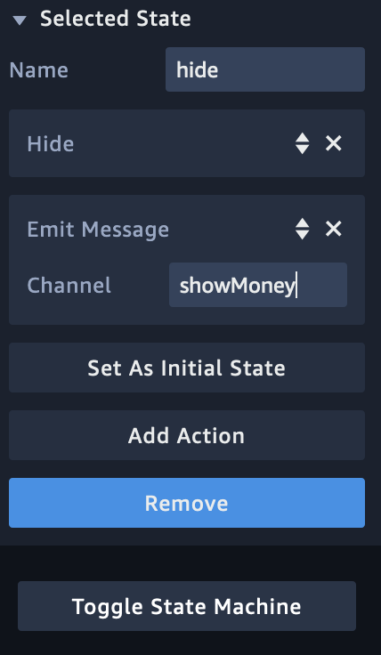

12. click the "on click/tap entity" and drag a line to "hide" state

### red pack and money action setting
1. click the "box with money" entity.

2. click "add component" button, choose "state machine"

3. click the "+"(plus) button 

4. input the behavior name and input the state name"listen"

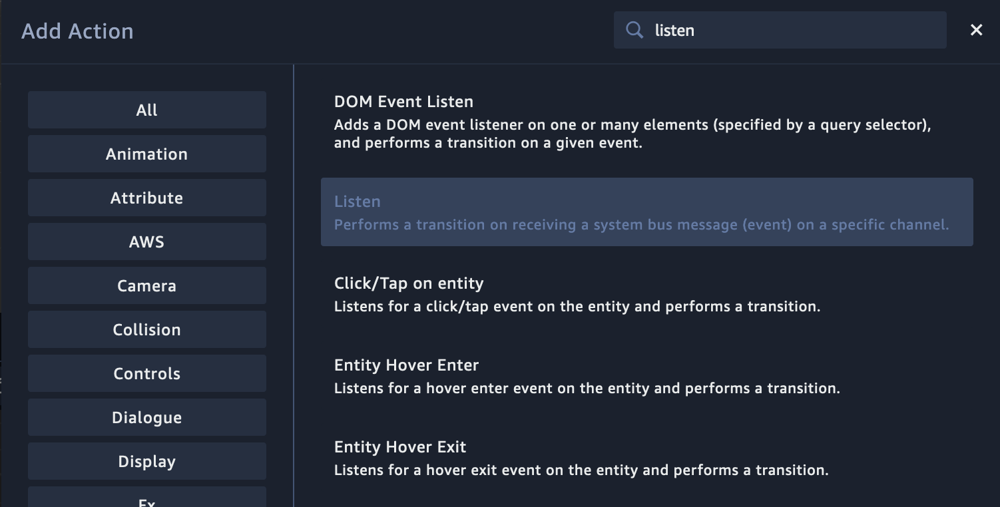

5. click add action

6. input "listen" in the search area and choose the "listen" click "add"

    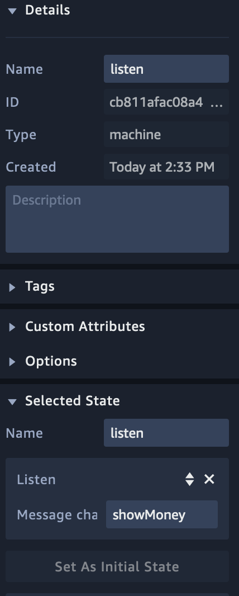

7. click "add state"

8. drag the "state 1" rectangle to the right side

9. name the state "show"

10. click "Add action" and search show, click show

11. click the "listen" and drag a line to "show" state

12. do that again on 3 mmoney entities

## config set
1. click the eye button on the left console, the corresponding entity will be disappear.

    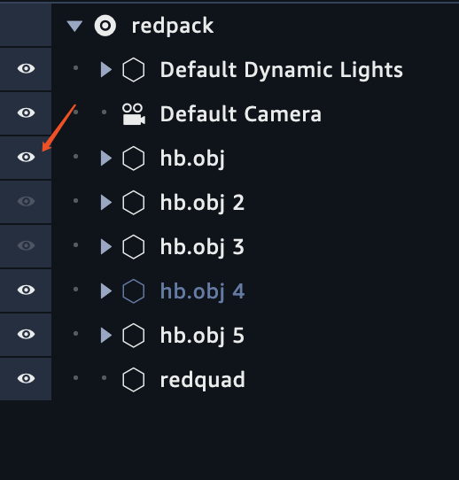
